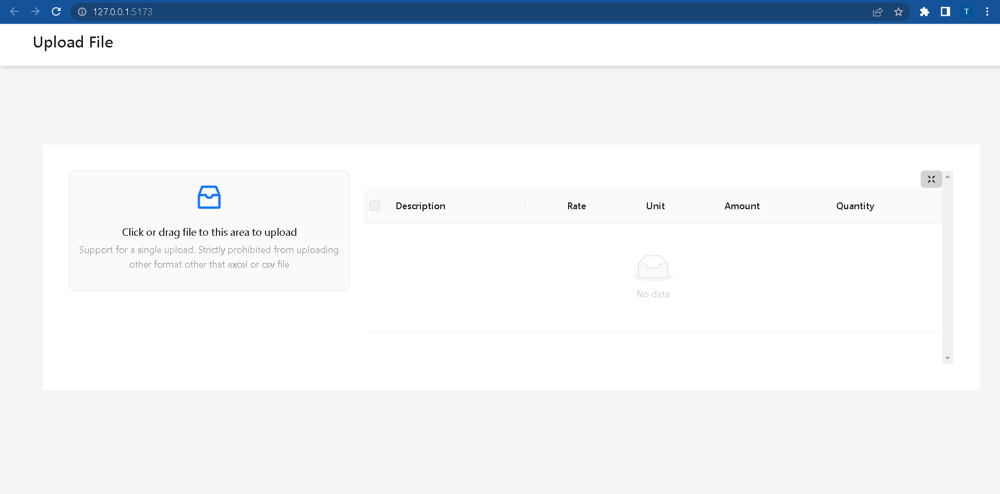
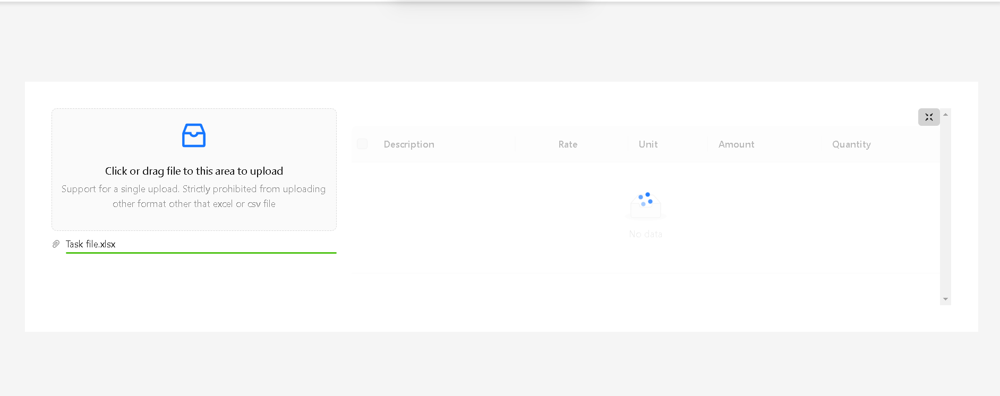
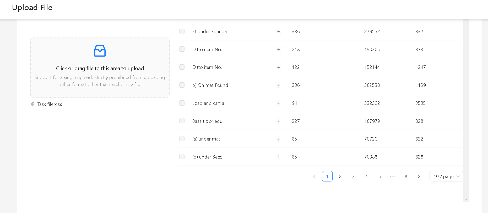
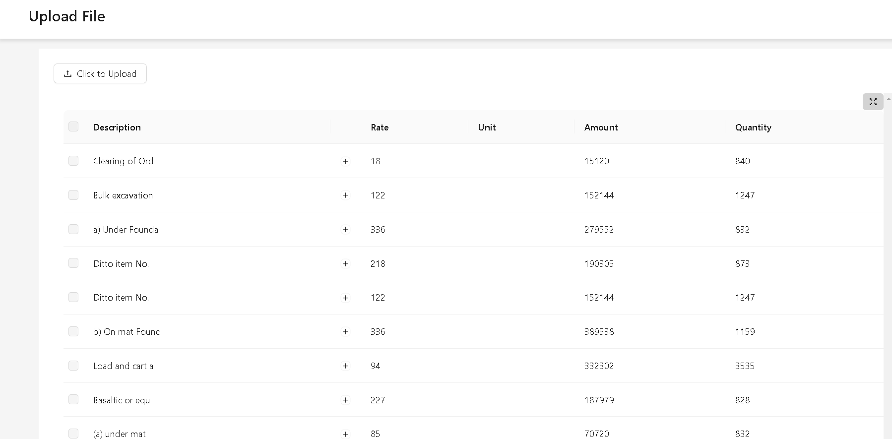
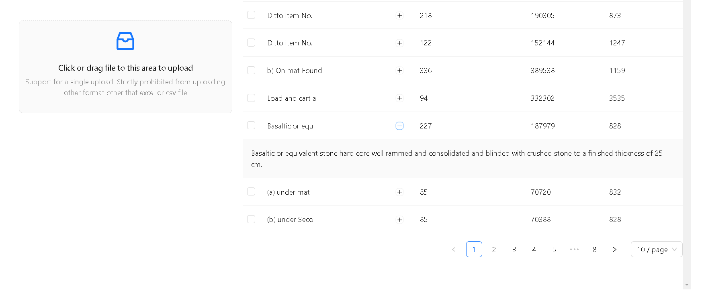
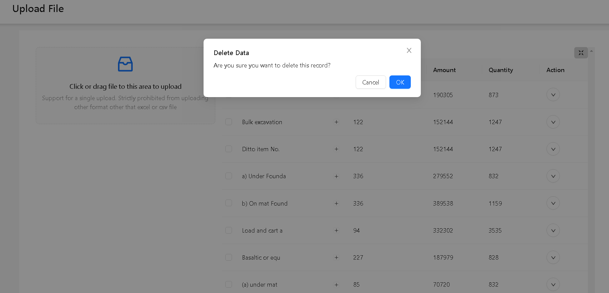
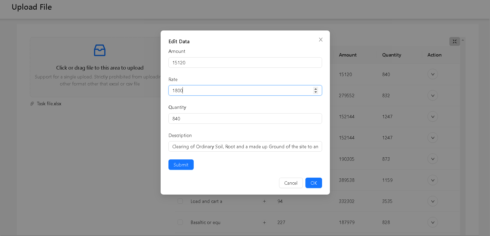

## Fullstack Application with Ant Design, Vite, Node.js, TypeScript, and Sequelize

This is a fullstack application that showcases how to build a modern web application using Ant Design, Vite, Node.js, TypeScript, and Sequelize. The frontend is designed using Ant Design and Vite, which provides a fast and modern web development experience. The backend is built using Node.js and TypeScript, and uses Sequelize to manage the database.

## Designed and Developed By
    # Hanibal Girmay

# Features
Responsive design using Ant Design components
Fast and modern frontend development experience using Vite
Secure and scalable backend using Node.js and TypeScript
Database management using Sequelize ORM

# Screenshot
The main Page when the application run with a functionalizty of Drag and Drop with clickable button to select file on the side bar and a table showing the result on the left with expandable to full screen button icon found on the right side of the table



****


To Show Full information When Expand button clicked to view all the description



```

# Getting Started
To get started with the application, follow these steps:

Clone the repository using the following command:

Copy
git clone https://github.com/hanibalgirmay/excel-upload-preview.git
```

Install the dependencies for both the frontend and backend by running the following commands:

Copy
cd fileImporter
yarn install
cd api
yarn install
```

Start the frontend and backend development servers by running the following commands:

Copy
cd fileImporter
yarn dev
cd api
yarn dev
```

Open your web browser and go to http://localhost:5173 to see the application in action.
for the API to http://localhost:4500 to see the application in action.

Screenshots
Here are some screenshots of the application:

Technologies Used
Ant Design - A UI library for React that provides a large set of high-quality components and layouts.
Vite - A fast and modern build tool for frontend development.
Node.js - A JavaScript runtime built on Chrome's V8 JavaScript engine.
TypeScript - A typed superset of JavaScript that compiles to plain JavaScript.
Sequelize - A powerful ORM for Node.js that supports multiple databases.
